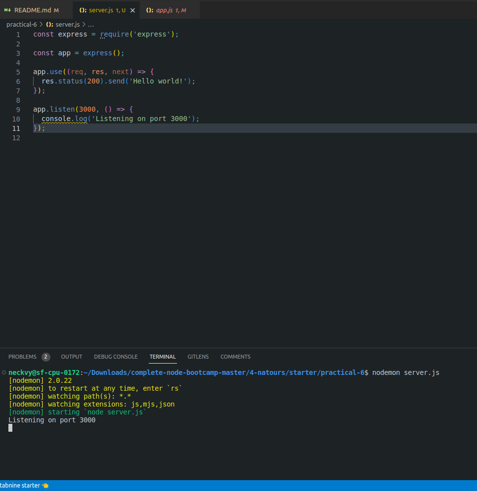
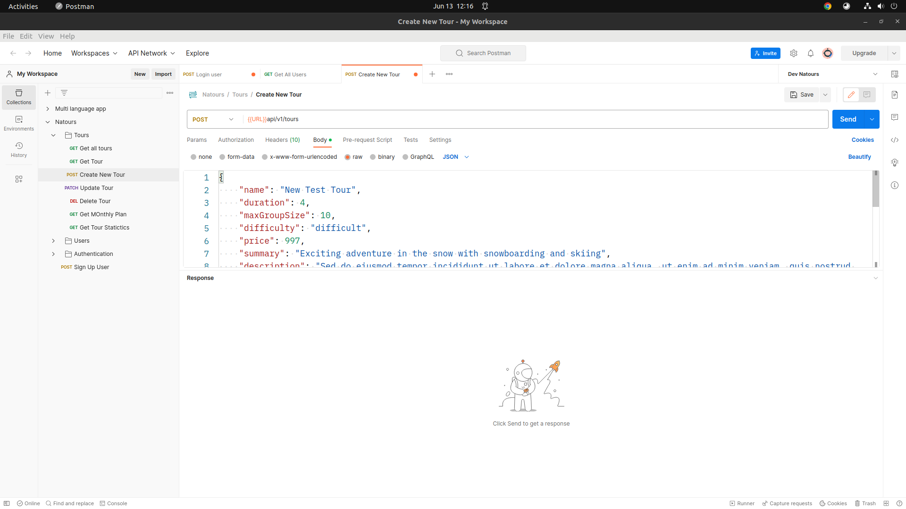
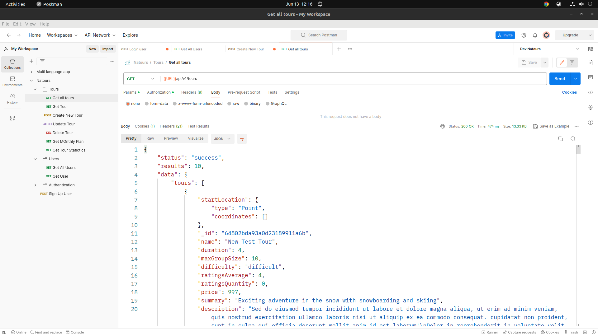

# Natours Tour

<br>

# PRACTICAL-2

## Create node project

    npm init- used to set up new or existing npm package

- If we want to set up npm package without having it ask any questions then:

```
    npm init -y
```

- A package.json file will be generated
- To start the node project, visit: [server.js](./practical-2/server.js)
<br><br><br><br>
<hr>

# PRACTICAL 3

## Learn about Package.json file and add necessary property in our project package.json file

- package.json holds important information about the project
- It contains human-readable metadata about the project (like the project name and description) as well as functional metadata like the package version number and a list of dependencies required by the application.
- It helps us to configure how to interact with and run our application
- Our project must include **_package.json_** file before installing any packages from the NPM

- All the necessary dependencies and properties required for this project are added in the `package.json` file: [package.json](./package.json)
<br><br><br><br>
<hr>

# PRACTICAL-4

## Learn and execute cli command

- Using CLI(Command Line Interface) commands we can interact with our Computer's OS or perform specific actions or programs
- In [server.js](./practical-4/server.js) :
  <br><br>

1.  `TZ` - The TZ environment variable is used to specify the timezone configuration.
    
    In the above image, we can see the use case of TZ variable
    <br><br>
2.  `--max-old-space-size=SIZE (in megabytes)` - is used to specify the maximum amount of memory a JavaScript program can use for its old memory section (the old memory section is where long-lived objects and data are stored during the execution of a JavaScript program) , ensuring that enough memory is available for other tasks and preventing performance issues.

```
  $ node --max-old-space-size=1536 index.js
```

- In the above code we are setting the maximum memory limit to 1.5 Gib
- If the **_--max-old-space-size exceeds_** exceeds the memory specified then the V8 engine will spent more time on garbage collection(freeing up memory occupied by objects that are no longer needed). Also it will result in **_Out of memory_** type errors
- If the memory exceeds, then it can affect the overall performance of the system as well.
<br><br>

3.  `FORCE_COLOR=[1, 2, 3]` - is typically used to force color output in command-line interfaces (CLIs) that support ANSI escape sequences for styling and coloring text.
- Setting the FORCE_COLOR environment variable to different values can have different effects:

- When FORCE_COLOR is set to `1`, it enforces color output. This means that even if the terminal does not support color, the CLI will still output colored text.

- When FORCE_COLOR is set to `0`, it disables color output. In this case, even if the terminal supports color, the CLI will produce plain text without any coloring.

- When FORCE_COLOR is set to `2` or any other non-zero value, it enables color output if the terminal supports it. If the terminal does not support color, the output will be plain text.

<br> <br><br><br>

<hr>

# PRACTICAL-5

## Create http server in local system

- Created http server in [app.js](./app.js) using express

```
const express = require('express');
const app = express();
module.exports = app;
```

- where I required express module
- Importing the app module in [server.js](./server.js) where it is listening on port 8000

```
const app = require('./app');
const port = process.env.PORT || 3000;
app.listen(port, () => {
  console.log(`App running on port ${port}`);
});
```

- 

<br><br><br><br>

<hr>

# PRACTICAL-6

## create a simple hello world application in node.js

in [practical-6](./practical-6/server.js)
<br>

<br>


<br><br><br><br>

<hr>

# PRACTICAL-7

## Postman and its usages

- Postman is a beautiful tool that allows us to do **API testing**
- It doesn’t render any html or websites to us
- We can do all kinds of requests and receive the response simply as text and work with it
- **Postman simplifies API development**
- Using Postman, we can make HTTP requests and also test API endpoints
  <br><br>
- Uses of Postman:
  1. Using Postman we can send HTTP requests such as GET,POST,PUT,DELETE,PATCH etc to API endpoints and examine the response
  2. We can set **request headers** , **parameters** , **body content** , **environment variables** etc
  3. We can also organize our requests into folders, subfolders making it more accessible for us to manage

Live use case-
- Collection structure in postman
 
<br><br>
- LIve working in postman


<br><br><br><br>

<hr>

# PRACTICAL-8

## Rendering Engines and its usage

- Rendering engine renders the web content by interpreting HTML,CSS,JS and presenting it visually on the screens

  - Check out the practical [multi-language-app](./practical-12/views/index.ejs) for rendering engine (ejs) template
  - Also can checkout- [natours-pug-base-template](./views/base.pug)
  - Also can checkout- [natours-pug-overview-template](./views/overview.pug)
  - Also can checkout- [natours-pug-header-template](./views/_header.pug)
  - Also can checkout- [natours-pug-footer-template](./views/_footer.pug)

<br><br><br><br><br>

<hr>

# PRACTICAL-9

## Security, Authentication & Authorization

### 1. Sample demo for creating jwt token and also verifying it (jwt sign, verify & decode).
### 2. Create a demo api in which send username and password and verify them whether user is valid or not. 
- reference: [jwt tokens and verification](./controllers/authenticationController.js)

<br><br>
### 3. Use cookie, cors, helmet in your web app.
- reference: [helmet](./app.js)
- reference: [cookie](./controllers/authenticationController.js)

<br><br><br><br>

<hr>

# PRACTICAL-10

## Error Handling & HTTP status codes
- reference: [error handler](./utils/appError.js) and [error handling and status codes](./controllers/authenticationController.js)

<br><br><br><br>

<hr>

# PRACTICAL-11

## File Operations

<hr>
 Perform basic file operation like creating file, reading from file, writing to the file, appending to the file, streaming to the file. \n
 Use multer to upload file.
<hr>
<br><br>

- Link to the file- [FileOperations](./practical-11/app.js)
- In terminal:

```
      cd .. (if your are inside some other practical folder)
      cd practical-11
      nodemon app.js
      
```

    
  - Open localhost:3000 and can specify the routes as follows:
    - `localhost:3000/uploadFile` - for uploading a image.
    - `localhost:3000/createFile` - for creating a file.
    - `localhost:3000/appendFile` - for appending a file.
    - `localhost:3000/readFile` - for reading a file.
    - `localhost:3000/writeFile` - for writing a file.
    - `localhost:3000/readFileStream` - for reading the file in streams.
<br><br><br><br>

<hr>

# PRACTICAL-12

## Internationalization

- Check the practical in: [multi-language-app](./practical-12/app.js)
- To run the application:
  - In terminal:
    ```
      cd .. (if your are inside some other practical folder)
      cd practical-12
      nodemon app.js
    ```
    - Go to browser and start `localhost:3000` and select the language which you want the translation for.


